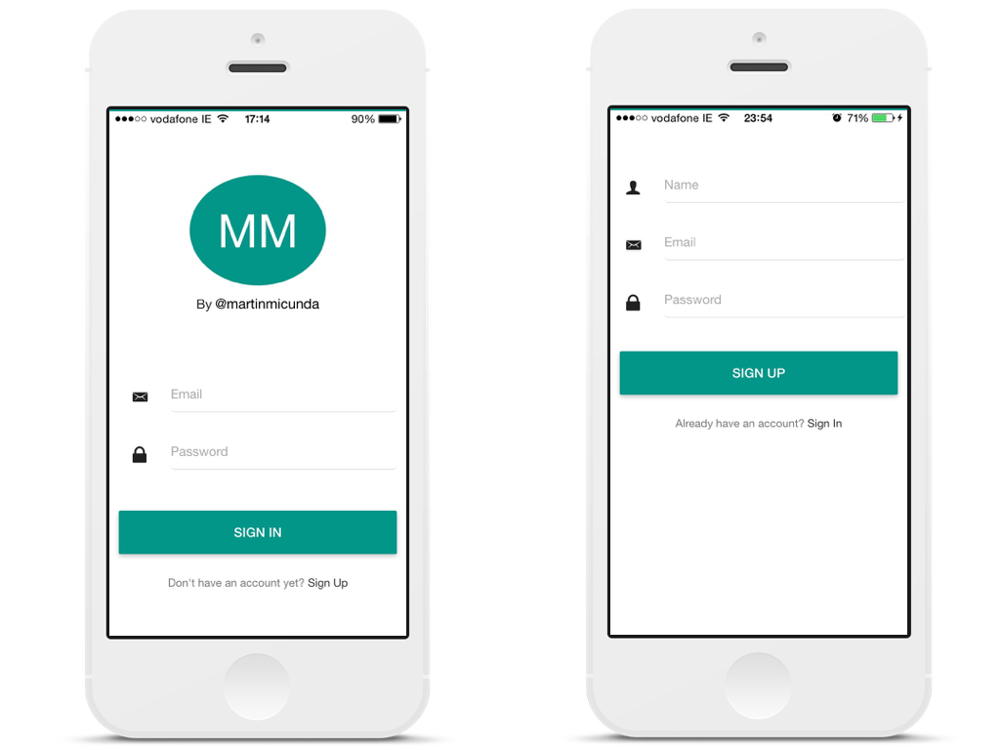
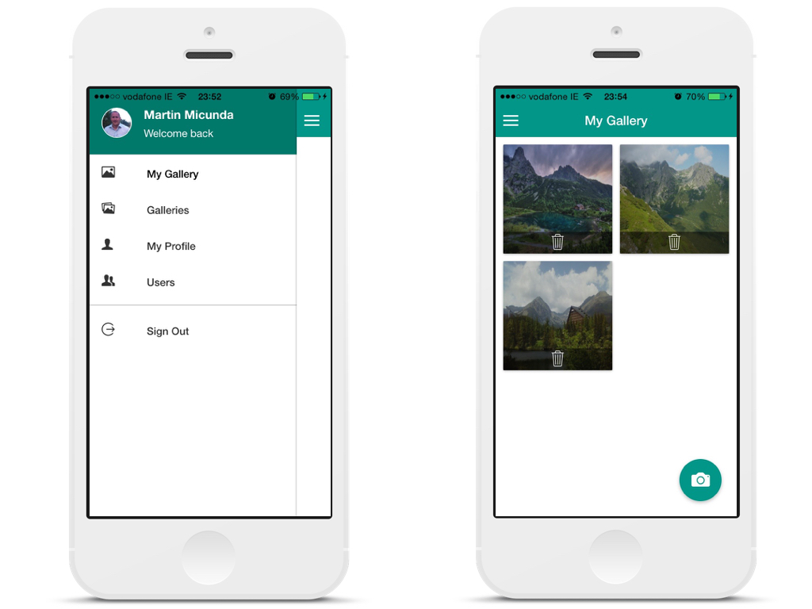
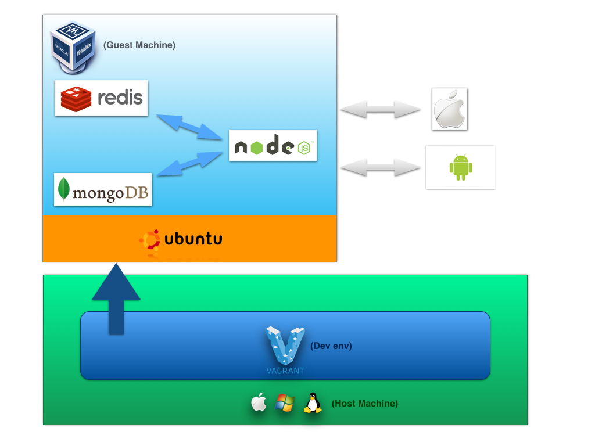

Ionic Photo Gallery
======================
 
[](https://heroku.com/deploy?template=https://github.com/martinmicunda/ionic-photo-gallery/tree/heroku)

A hybrid app with authentication that allows registered users view a gallery of photos they have uploaded via the camera phone. The blog post I have written about this project can be found on my [blog](http://martinmicunda.com/2015/04/10/build-ionic-photo-gallery-app-I/). 




## Table of Contents
- [Technologies Used](#technologies-used)
- [Architecture Diagram](#architecture-diagram)
    - [Development](#diagram-development)
- [Installation & Configuration](#installation-and-configuration)
    - [Platform & Tools](#platform-and-tools)
    - [Installation](#installation)
- [Running App](#running-app)
    - [Server](#server) 
    - [Ionic](#ionic) 
- [Building for iOS](#building-for-ios)
- [Building for Android](#building-for-android)
- [Vagrant](#vagrant)
- [Ansible](#ansible)
- [FAQ](#faq)
- [License](#license)

## Technologies Used
| Mobile Side | Server Side | DevOps | 
|:-------------------:|:-------------------:|:-------------------:| 
| [Angular.js](http://angularjs.org/)  | [Node.js](http://nodejs.org/)  | [Gulp](http://gulpjs.com/)  &nbsp; [Bower](http://bower.io/) ![Bower] (https://avatars3.githubusercontent.com/u/3709251?s=30) |
[Ionic](http://ionicframework.com/)  | [MongoDB](http://www.mongodb.org/) ![MongoDB] (https://avatars3.githubusercontent.com/u/45120?v=2&s=30) | [NPM](https://www.npmjs.org/) ![NPM] (https://avatars0.githubusercontent.com/u/6078720?s=30) &nbsp;                 [Ansible](https://www.ansible.com/) ![Ansible] (https://avatars3.githubusercontent.com/u/1507452?v=2&s=30) | 
[Material Design](https://material.angularjs.org/)  | [Express.js](http://expressjs.com/) | [Vagrant](http://www.vagrantup.com/)  |
| [Cordova](https://cordova.apache.org/)  | [Redis](http://redis.io/)  | 

## Architecture Diagram
### <a name="diagram-development"></a>Development


## <a name="installation-and-configuration"></a> Installation & Configuration
### <a name="platform-and-tools"></a> Platform & Tools
You need to have installed follow tools on your machine:

- [Virtualbox](https://www.virtualbox.org/wiki/Downloads) 4.3.16+
- [Vagrant](http://www.vagrantup.com/downloads.html) 1.6.2+
- [Ansible](http://docs.ansible.com/intro_installation.html) 1.7.0+

### <a name="installation"></a> Installation

**1.** Clone main repository:
```bash
$ git clone git@github.com:martinmicunda/ionic-photo-gallery.git 
$ cd ionic-photo-gallery
```

**2.** The following command would add a new `ubuntu trusty64 box`, and if an existing one is found, it will override it:

```bash
$ vagrant box add ubuntu/trusty64 --force
```
>**NOTE:** This process may take a while, as most Vagrant boxes will be at least **200 MB** big.

Verify that box was installed by running the `list` subcommand that will list the boxes installed within Vagrant along with the provider that backs the box:

```bash
$ vagrant box list
ubuntu/trusty64  (virtualbox, 14.04)
```
**3.** The following command would install an `ansible roles` for this project, and if an existing one is found, it will override it:

```bash
$ bash bin/ansible-install-roles.sh
```
Verify that ansible roles were installed by running the `list` subcommand that will list the installed roles:

```bash
$ ansible-galaxy list
- DavidWittman.redis, 1.0.3
- laggyluke.direnv, v2.6.0
- martinmicunda.common, v1.0.1
- martinmicunda.ionic, v1.0.0
- martinmicunda.nodejs, v1.0.1
- nickp666.android-sdk, v0.0.1
- Stouts.mongodb, 2.1.8
- williamyeh.oracle-java, master
```
**4.** Now, run `vagrant up` that will create and provisioning `default` VM box. 

```bash
$ vagrant up
```
>**NOTE:** **Vagrant will provision the virtual machine only once on the first run, any subsequent provisioning must be executed with the** `--provision` **flag either** `vagrant up --provision` **or** `vagrant reload --provision` **or** `vagrant provision` **if vagrant box is already running. The provisioning will re-run also if you destroy the VM and rebuild it with** `vagrant destroy` **and** `vagrant up` **.**

If there have been no errors when executing the above commands, the machines  `default` should be created. The following command would outputs status of the vagrant machine:

```bash
$ vagrant status
Current machine states:
default                   running (virtualbox)
```
Now you should be able to ssh into box:
```bash
$ vagrant ssh 
```
## Running App
### Server
**1.** To start the server you need to ssh into box:
```bash
$ vagrant ssh
```
**2.** Install the server dependencies:
```bash
$ cd server
$ npm install
```
**3.** Start the server:
```bash
$ npm start
```
>**NOTE:** **The [direnv](http://direnv.net/) is use as an environment variable manager so when you first time cd into server directory with a `.envrc` file in it, it will refuse to load the file. This is to protect you, since the contents of the .envrc will be executed by your shell, and they might come from untrusted sources. Simply run `direnv allow`, and it will trust that file until the next time it changes.**

### Ionic
**1.** To start the server you need to ssh into box:
```bash
$ vagrant ssh
```
**2.** Install the ionic dependencies:
```bash
$ cd ionic
$ npm install
```
**3.** Start the ionic:
```bash
$ npm start
```
Open up your browser and navigate to [http://127.0.0.1:8100](http://127.0.0.1:8100) and you should see ionic app up and running.

## <a name="building-for-ios"></a> Building for iOS
**1.** ssh into box:
```bash
$ vagrant ssh
```
**2.** Add support for the iOS platform:
```bash
$ cd ionic
$ ionic platform add ios
```
**3.** Build the project:
```bash
$ ionic build ios
```
**4.** Open `ionic-photo-gallery.xcodeproj` in the `ionic-photo-gallery/ionic/platforms/ios` folder.

**5.** In [Xcode](https://developer.apple.com/xcode/), run the application on a device connected to your computer or in the iOS emulator.

## <a name="building-for-android"></a> Building for Android
**1.** ssh into box:
```bash
$ vagrant ssh
```
**2.** Add support for the Android platform:
```bash
$ cd ionic
$ ionic platform add android
```
**3.** Build the project:
```bash
$ ionic build android
```

**NOTE:** (martin) work in progress!!

1. Start Genymotion
2. Open Genymotion Shell
3. Run follow command to get IP address

```bash
$ devices list
```
you should see something like this:

```bash
Genymotion virtual device 0 is off. Please select a new virtual device with command : devices select
Available devices:

 Id | Select |    Status     |   Type   |   IP Address    |      Name
----+--------+---------------+----------+-----------------+---------------
  0 |        |            On |  virtual |  192.168.58.101 | Samsung Galaxy S4 - 4.4.4 - API 19 - 1080x1920
```
5. Go to vagrant box using 'vagrant up' and 'vagrant ssh'.
6. Type: `adb connect 192.168.56.101` and `adb devices`. You should see something like this:
```
vagrant@vagrant-ubuntu-trusty-64:~$ adb connect 192.168.58.101
connected to 192.168.58.101:5555
vagrant@vagrant-ubuntu-trusty-64:~$ adb devices
List of devices attached
192.168.58.101:5555     device
```
7. Run `ionic run android`

## Vagrant 
There’s a ton of commands you can use to talk to Vagrant. For a full list see the [official docs](http://docs.vagrantup.com/v2/cli/), but here are the more common ones.

* `vagrant up` - use this command to `start` your virtual environment
* `vagrant halt` - use this command to `stop` your virtual environment
* `vagrant suspend` - use this command to `pause` your virtual environment, make sure you do this before shutting down your computer to safely be able to restore the environment later.
* `vagrant destroy` - use this command to `removes` your virtual environment from your machine
* `vagrant reload` - use this command to your virtual environment, if you add the `--provision` flag, it will reprovision the box as well; this is useful with removing or adding things to the server via Ansible.
* `vagrant ssh` - use this command to `connect` to the virtual server

## Ansible
To get better understanding how Ansible works check the [official docs](http://docs.ansible.com/). Ansible installs the following software:

* [git](http://git-scm.com/)
* [node.js](https://nodejs.org/)
* [npm](https://www.npmjs.com/)
* [mongodb](https://www.mongodb.org/)
* [redis](http://redis.io/)
* [java 7](http://www.oracle.com/technetwork/java/javase/downloads/jre7-downloads-1880261.html)
* [android SDK](https://developer.android.com/sdk/index.html)
* [apache ant](http://ant.apache.org/)
* [cordova](https://cordova.apache.org/)
* [ionic CLI](http://ionicframework.com/docs/cli/)
* [direnv](http://direnv.net/)

The `mongodb` and `redis` services are started after provisioning takes place.

## FAQ
### What if I want to uninstall application?
**1.** The following command would permanently removes the `default` virtual box from your machine:
```bash
$ vagrant destroy
```
**2.** The following command would uninstall an `ansible roles` for this project:
```bash
$ bash bin/ansible-uninstall-roles.sh
```

**4.** The following command would remove  `trusty64 box`:
```bash
$ vagrant box remove trusty64
```
### What if I want a fresh install?
If you wish to destroy the `default` virtual boxe to make sure you have a fresh start, you can do these steps:
```bash
 $ vagrant destroy 
 $ vagrant up
```

## License

    The MIT License
    
    Copyright (c) 2015 Martin Micunda  

    Permission is hereby granted, free of charge, to any person obtaining a copy
    of this software and associated documentation files (the "Software"), to deal
    in the Software without restriction, including without limitation the rights
    to use, copy, modify, merge, publish, distribute, sublicense, and/or sell
    copies of the Software, and to permit persons to whom the Software is
    furnished to do so, subject to the following conditions:
    
    The above copyright notice and this permission notice shall be included in
    all copies or substantial portions of the Software.
    
    THE SOFTWARE IS PROVIDED "AS IS", WITHOUT WARRANTY OF ANY KIND, EXPRESS OR
    IMPLIED, INCLUDING BUT NOT LIMITED TO THE WARRANTIES OF MERCHANTABILITY,
    FITNESS FOR A PARTICULAR PURPOSE AND NONINFRINGEMENT. IN NO EVENT SHALL THE
    AUTHORS OR COPYRIGHT HOLDERS BE LIABLE FOR ANY CLAIM, DAMAGES OR OTHER
    LIABILITY, WHETHER IN AN ACTION OF CONTRACT, TORT OR OTHERWISE, ARISING FROM,
    OUT OF OR IN CONNECTION WITH THE SOFTWARE OR THE USE OR OTHER DEALINGS IN
    THE SOFTWARE.
